# Post-Prompt Observability Viewer

A single-page application for visualizing SignalWire AI Agent post-conversation webhook payloads and SWML configuration files. Upload a JSON payload from a completed call and instantly see performance metrics, conversation flow, tool usage, latency analysis, and full call recordings with stereo waveform visualization. Also supports SWML inspection with interactive state diagrams and prompt analysis.

Built with **Vanilla JS**, **Vite**, **Chart.js**, **Mermaid**, and **wavesurfer.js** — no framework dependencies.

## 🆕 Agent Builder

The project now includes a **visual drag-and-drop agent builder** for creating SignalWire AI agents!

- **Location**: `/ui` directory
- **Dev Server**: `http://localhost:5177` (when running)
- **Features**: Visual canvas, step/function nodes, SWML export, Python SDK code generation

See [`ui/README.md`](ui/README.md) for full documentation.

## Screenshots

### Drop Zone (Start Screen)
Dual upload interface supporting both Post-Prompt conversation files and SWML configuration files. Drag-and-drop or click to browse.

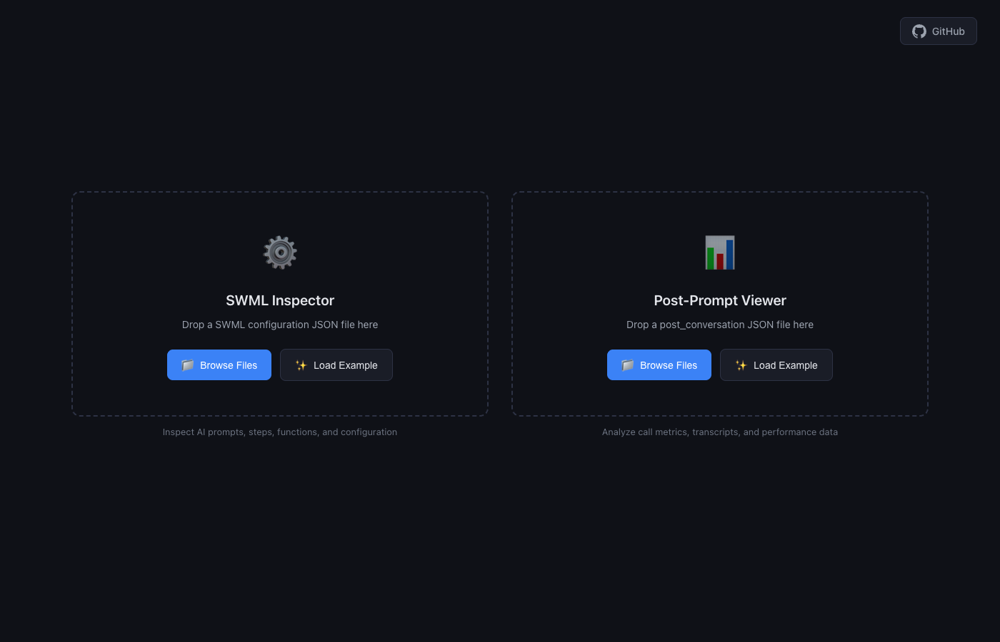

### Dashboard
KPI metric cards covering call duration, response latency (assistant and tool), system performance rating, conversation stats, token usage, SWAIG details, and media/billing summaries.

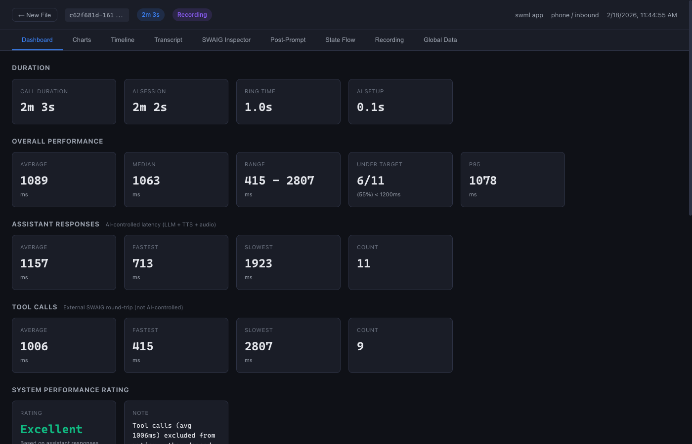

### Charts
Six interactive Chart.js visualizations: dual latency breakdown charts (assistant responses and tool calls), tokens per second, ASR confidence per utterance, speech detection timing, message role breakdown donut, and SWAIG latency by command.

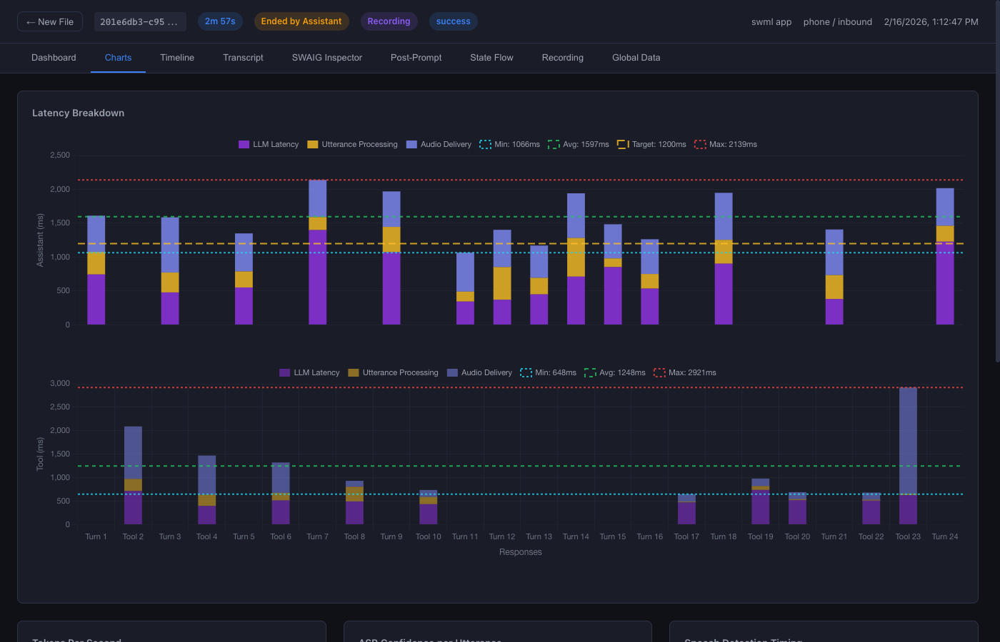

### Timeline
Horizontal swimlane view of the full call lifecycle. The top bar shows call phases (ring, setup, AI session, teardown). Below, a conversation flow chart maps every user, assistant, tool, say, and system message to its real timestamp.

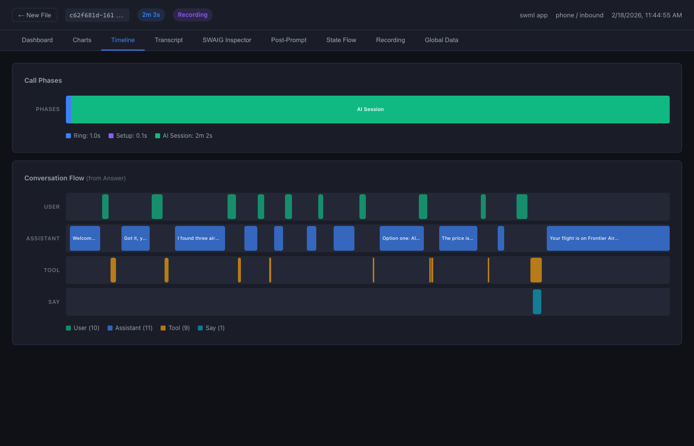

### Transcript
Scrollable conversation log with role-colored message bubbles (system, assistant, tool, user). Each message includes expandable metadata badges for latency, audio timing, ASR confidence, and timestamps. Includes response time rating badges (Excellent, Good, Fair, Needs Improvement) and filters for finding slow responses.


### SWAIG Inspector
Expandable accordion of every SWAIG function call made during the session. Each entry shows the full `post_data` request and `post_response` as formatted JSON with search functionality that auto-expands nested items and filters to matching fields only.

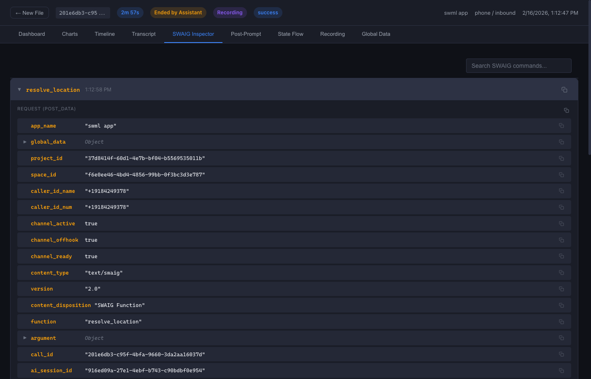

### Post-Prompt
Displays the post-prompt execution result with Raw and Substituted sub-tabs. Shows what the AI agent executed after the conversation ended (e.g., summary functions, data extraction).

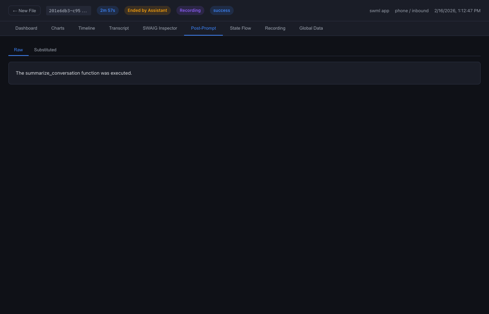

### State Flow
Interactive Mermaid diagram visualizing the conversation flow as a state machine. Shows the progression through states, functions, and prompts with scrollable viewport and PNG export capability.

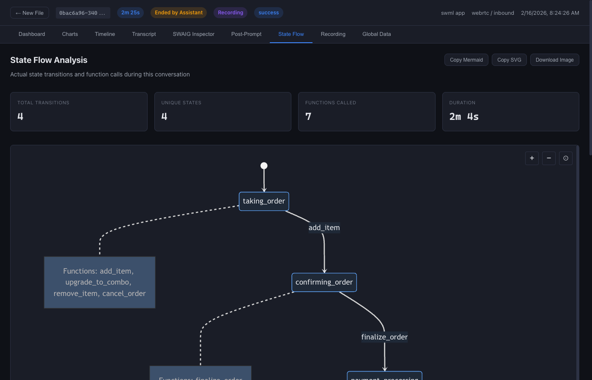

### Recording
Stereo waveform visualization powered by wavesurfer.js with color-coded overlay regions (user speech, endpointing, assistant, tool calls, thinking, manual say, barge-in). Includes synced video playback, speed controls, and a scrubbing cursor that displays the matching transcript line.

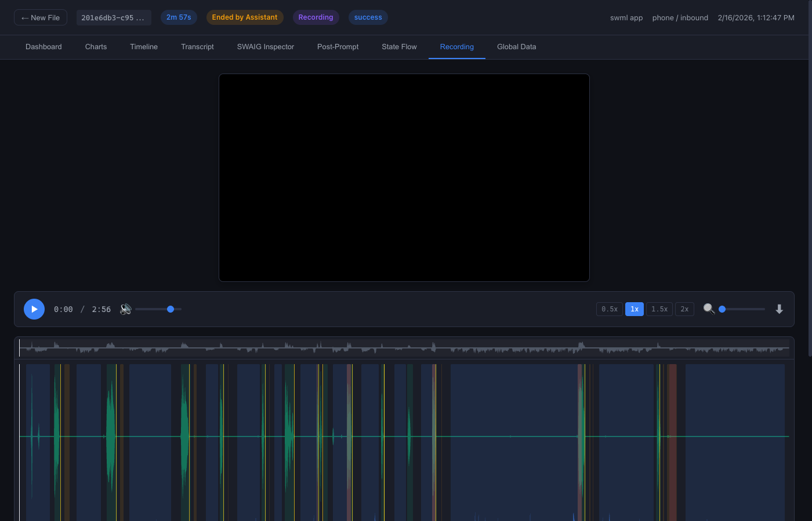

### Global Data
Expandable JSON view of session state at end of call, including `global_data` (set by SWAIG `set_global_data` actions), `SWMLVars` (runtime call variables), and `SWMLCall` signaling-layer metadata. Includes search with auto-expand and field-level filtering.

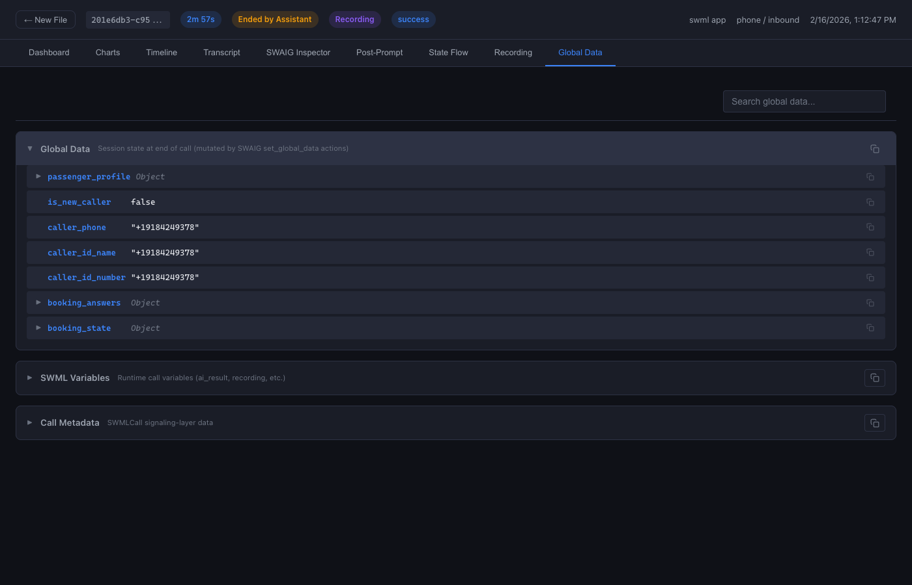

### SWML Overview
Inspector for SignalWire Markup Language (SWML) configuration files. Overview tab shows general configuration, sections, and high-level structure.


### SWML Prompts & Steps
Detailed view of SWML prompts and steps with interactive Mermaid state diagrams. Supports both text and bullet-point prompt formats with PNG export for diagrams.


### SWML Functions
Expandable list of all SWML functions with their parameters, purposes, and metadata arguments.

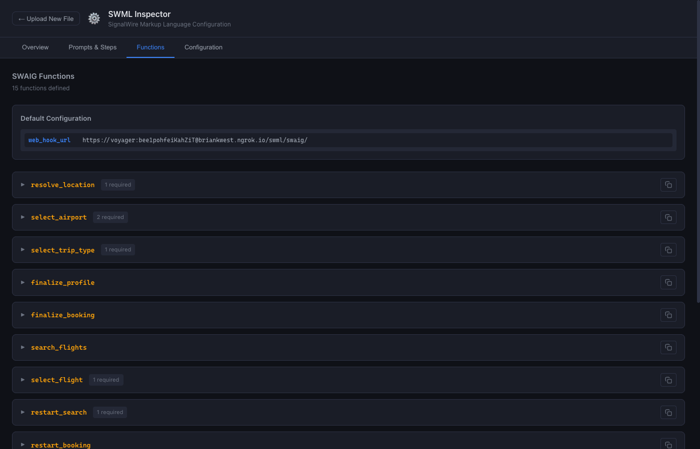

### SWML Configuration
Raw JSON view of SWML configuration including parameters, hints, language settings, and other top-level configuration options.

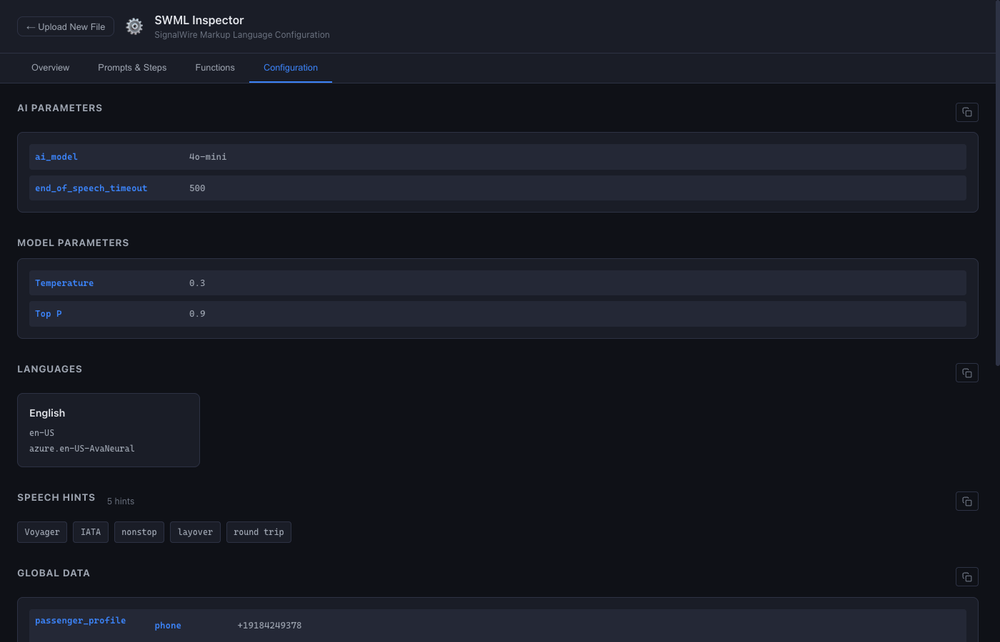

## What This Does

When a SignalWire AI Agent call completes, the platform emits a `post_conversation` webhook payload containing everything that happened during the call: the full conversation log, SWAIG function calls, ASR confidence scores, token usage, latency measurements, and more.

This viewer parses that payload and presents it across nine interactive tabs:

| Tab | What It Shows |
|-----|---------------|
| **Dashboard** | 16 KPI metric cards — call duration, response latency, token usage, ASR confidence, barge-in rate, SWAIG call count, TPS stats |
| **Charts** | 6 Chart.js visualizations — response latency over time, tokens per second, ASR confidence distribution, message role breakdown, SWAIG execution latency, call timeline phases |
| **Timeline** | Horizontal swimlane showing the full call lifecycle — user speech, assistant responses, tool calls, thinking, manual says, all mapped to real timestamps |
| **Transcript** | Scrollable conversation with role-colored message bubbles, expandable metadata (latency, confidence, tool results), response time rating badges, and filters for finding slow responses |
| **SWAIG Inspector** | Accordion list of every SWAIG function call with full `post_data` and `post_response` as formatted JSON, search with auto-expand and field-level filtering |
| **Post-Prompt** | Tabbed view of raw, substituted, and parsed post-prompt data |
| **State Flow** | Interactive Mermaid diagram visualizing conversation flow as a state machine with scrollable viewport and PNG export |
| **Recording** | Stereo waveform visualization with call-log regions overlaid, synced video playback for MP4 recordings, playback controls with speed adjustment |
| **Global Data** | Expandable JSON view of `global_data`, `SWMLVars`, `SWMLCall`, and other top-level payload fields with search and field-level filtering |

Additionally, the viewer supports **SWML Inspector** mode for analyzing SignalWire Markup Language configuration files with four dedicated tabs:

| SWML Tab | What It Shows |
|----------|---------------|
| **Overview** | General configuration summary, sections, and high-level structure |
| **Prompts & Steps** | Interactive Mermaid state diagrams showing prompt flow with PNG export |
| **Functions** | Expandable list of all functions with parameters and metadata |
| **Configuration** | Raw JSON view of all SWML configuration options |

## Quick Start

```bash
# Clone the repo
git clone https://github.com/signalwire-demos/postpromptviewer.git
cd postpromptviewer

# Install dependencies
npm install

# Start the dev server
npm run dev
```

Open the URL shown in the terminal (default: `http://localhost:5173`), then drag and drop a post-conversation JSON file onto the page.

## Building for Production

```bash
npm run build
```

The output goes to `dist/` — a static bundle you can serve from any web server, S3 bucket, or CDN. No backend required.

```bash
# Preview the production build locally
npm run preview
```

## Project Structure

```
├── lib/                        # Standalone library (zero DOM dependencies)
│   ├── index.js                # Public API: parsePayload, computeMetrics
│   ├── parser.js               # Validates + normalizes raw JSON payload
│   ├── utils.js                # Shared helpers (epoch→Date, stats, formatting)
│   └── metrics/
│       ├── duration.js         # Call/AI/ring durations from timestamps
│       ├── latency.js          # Assistant response latency (min/max/avg/p95)
│       ├── asr.js              # ASR confidence stats, barge-in rate
│       ├── conversation.js     # Turn count, messages by role, word counts
│       ├── tools.js            # SWAIG call count, execution latency, action types
│       └── tokens.js           # Token totals, TPS stats from times[]
├── src/                        # Viewer SPA
│   ├── main.js                 # App entry: mounts components, wires tab navigation
│   ├── state.js                # Pub/sub store for payload, metrics, UI state
│   ├── components/
│   │   ├── drop-zone.js        # Drag-and-drop + file picker for JSON upload
│   │   ├── header.js           # Call ID, timestamps, duration badge, caller info
│   │   ├── dashboard.js        # 4x4 grid of metric cards
│   │   ├── charts.js           # 6 Chart.js visualizations
│   │   ├── timeline.js         # Horizontal swimlane: call lifecycle phases
│   │   ├── transcript.js       # Role-colored conversation bubbles
│   │   ├── swaig-inspector.js  # Expandable SWAIG log with formatted JSON
│   │   ├── post-prompt.js      # Post-prompt summary (raw/substituted/parsed)
│   │   ├── recording.js        # Stereo waveform + video playback via wavesurfer.js
│   │   └── global-data.js      # Raw payload data viewer
│   └── styles/
│       ├── theme.css           # Dark theme, CSS custom properties
│       └── components.css      # Component-specific styles
├── index.html                  # App shell
├── vite.config.js              # Vite configuration
└── package.json
```

## Using the Library Standalone

The `lib/` directory has no DOM dependencies and can be imported independently in Node.js or other browser apps:

```js
import { parsePayload, computeMetrics } from './lib/index.js';

const raw = JSON.parse(jsonString);
const payload = parsePayload(raw);      // Validates, normalizes timestamps
const metrics = computeMetrics(payload); // Returns all derived metrics

console.log(metrics.duration.callDuration);    // seconds
console.log(metrics.latency.avgAnswerTime);    // ms
console.log(metrics.asr.avgConfidence);        // 0-1
console.log(metrics.conversation.turnCount);   // number
console.log(metrics.tools.swaigCallCount);     // number
console.log(metrics.tokens.totalInputTokens);  // number or null
```

### Metric Modules

| Module | Key Outputs |
|--------|-------------|
| `duration` | `callDuration`, `aiSessionDuration`, `ringTime` — handles `call_end_date=0` (in-progress calls) |
| `latency` | `avgAnswerTime`, `p95AnswerTime`, `minAnswerTime`, `maxAnswerTime`, per-response latency array |
| `asr` | `avgConfidence`, `bargeInRate`, `bargeInCount`, `totalUserMessages` |
| `conversation` | `turnCount`, `messagesByRole`, `totalWords`, `assistantWordCount`, `userWordCount` |
| `tools` | `swaigCallCount`, `avgExecutionLatency`, `toolBreakdown` (by function name), `actionTypes`, `toolCallRate` |
| `tokens` | `totalInputTokens`, `totalOutputTokens`, `avgTps`, `peakTps`, per-response TPS array |

## Payload Format

The viewer expects the standard SignalWire `post_conversation` webhook payload. Required fields:

```json
{
  "call_id": "uuid",
  "action": "post_conversation",
  "call_start_date": 1770000000000000,
  "call_log": [...]
}
```

Key optional sections that unlock additional features:

| Field | Unlocks |
|-------|---------|
| `call_log[].timestamp` | Timeline swimlane, transcript ordering |
| `call_log[].audio_latency` | Response latency metrics and charts |
| `call_log[].confidence` | ASR confidence stats and histogram |
| `call_log[].speaking_to_final_event` | User speech duration on timeline |
| `times[]` | Tokens per second chart, detailed latency analysis |
| `swaig_log[]` | SWAIG Inspector tab |
| `post_prompt_data` | Post-Prompt tab |
| `SWMLVars.record_call_url` | Recording tab with waveform + video |
| `total_input_tokens` / `total_output_tokens` | Token usage dashboard cards |
| `global_data` | Global Data tab |

## Edge Cases Handled

- **`call_end_date = 0`** — displayed as "In Progress," duration computed from `ai_end_date`
- **Missing token fields** — cards show "N/A," token charts are skipped
- **No `times[]` array** — TPS and detailed latency charts gracefully hidden
- **DTMF content in call_log** — displayed appropriately in transcript
- **Merged user messages** (`merge_count > 0`) — displayed as single messages per `call_log`
- **Barged assistant responses** — removed from `call_log` by the platform, handled cleanly
- **TPS int64 overflow** (from `token_time: 0`) — filtered out of stats
- **Consecutive assistant messages** (retries, garbled output) — timeline segments don't overlap
- **Tool timestamps** — correctly treated as call initiation time, not result time
- **Negative `speaking_to_turn_detection`** — common in production, handled without error

## Tech Stack

| Tool | Purpose |
|------|---------|
| [Vite](https://vitejs.dev/) | Build tool and dev server |
| [Chart.js](https://www.chartjs.org/) | Dashboard and analytics charts |
| [wavesurfer.js](https://wavesurfer.xyz/) | Stereo waveform rendering, audio/video playback, regions overlay |

## License

MIT
